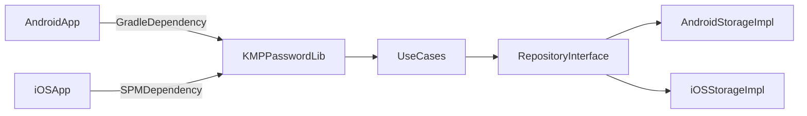

# Password Generator - Kotlin Multiplatform Library

A production-ready Kotlin Multiplatform library for generating secure passwords and passphrases. Supports Android, iOS, and JVM platforms.

## Features

- **Password Generation**: Generate secure passwords with customizable character sets (uppercase, lowercase, numbers, special characters)
- **Passphrase Generation**: Generate memorable passphrases using word lists
- **Settings Persistence**: Platform-specific implementations for saving/loading generator settings
- **Cryptographically Secure**: Uses platform-native secure random number generators
- **Type-Safe API**: Clean, documented Kotlin API with validation

## Architecture



## Installation

### Android

#### Option 1: Published Artifact (Maven Central)

Add to your `build.gradle.kts`:

```kotlin
dependencies {
    implementation("io.github.kotlin:library:1.0.0")
}
```

#### Option 2: Local Development

1. Add the library as a module dependency:

```kotlin
// settings.gradle.kts
include(":password-generator")
project(":password-generator").projectDir = file("../multiplatform-library-template-main/library")
```

2. Add dependency in your app's `build.gradle.kts`:

```kotlin
dependencies {
    implementation(project(":password-generator"))
}
```

### iOS

#### Option 1: Swift Package Manager (SPM)

1. **Build XCFramework**:
   ```bash
   cd multiplatform-library-template-main
   ./gradlew :library:buildXCFramework
   ```

2. **Add to Xcode**:
   - File → Add Package Dependencies
   - Enter repository URL or local path
   - Select version/tag

3. **Import in Swift**:
   ```swift
   import PasswordGenerator
   ```

#### Option 2: Local Development

1. Build XCFramework (see above)
2. In Xcode: File → Add Package Dependencies → Add Local...
3. Select the directory containing `Package.swift`

For detailed iOS distribution setup, see [ios-distribution-setup.md](ios-distribution-setup.md).

## Usage

### Android

#### 1. Set up Repository

```kotlin
import io.github.kotlin.passwordgenerator.AndroidPasswordGeneratorRepository
import io.github.kotlin.passwordgenerator.PasswordGeneratorUseCase
import io.github.kotlin.passwordgenerator.PassphraseGeneratorUseCase

class MainActivity : AppCompatActivity() {
    private val repository = AndroidPasswordGeneratorRepository(this)
    private val passwordUseCase = PasswordGeneratorUseCase(repository)
    private val passphraseUseCase = PassphraseGeneratorUseCase(repository)
    
    // Use coroutines scope
    private val scope = CoroutineScope(Dispatchers.Main + SupervisorJob())
    
    override fun onCreate(savedInstanceState: Bundle?) {
        super.onCreate(savedInstanceState)
        
        // Generate password
        scope.launch {
            val password = passwordUseCase(
                length = 16,
                includeUppercase = true,
                includeLowercase = true,
                includeNumbers = true,
                includeSpecialChars = true,
                excludeCharacters = "0O1lI" // Exclude ambiguous characters
            )
            println("Generated password: $password")
        }
        
        // Generate passphrase
        scope.launch {
            val passphrase = passphraseUseCase(
                wordCount = 4,
                separator = "-",
                includeUppercase = true,
                includeLowercase = true,
                includeNumbers = true,
                includeSpecialChars = false
            )
            println("Generated passphrase: $passphrase")
        }
    }
    
    override fun onDestroy() {
        super.onDestroy()
        scope.cancel()
    }
}
```

#### 2. Retrieve Saved Settings

```kotlin
scope.launch {
    val passwordSettings = repository.getPasswordSettings()
    val passphraseSettings = repository.getPassphraseSettings()
    
    // Use settings to pre-fill UI or regenerate with same settings
    val regeneratedPassword = passwordUseCase(
        length = 16,
        includeUppercase = passwordSettings.includeUppercase,
        includeLowercase = passwordSettings.includeLowercase,
        includeNumbers = passwordSettings.includeNumbers,
        includeSpecialChars = passwordSettings.includeSpecialChars,
        isPasswordRegenerate = true // Don't save settings again
    )
}
```

### iOS

#### 1. Set up Repository

```swift
import PasswordGenerator
import Foundation

class PasswordViewModel: ObservableObject {
    private let repository = IosPasswordGeneratorRepository()
    private let passwordUseCase = PasswordGeneratorUseCase(repository: repository)
    private let passphraseUseCase = PassphraseGeneratorUseCase(repository: repository)
    
    func generatePassword() async throws -> String {
        return try await passwordUseCase.invoke(
            length: 16,
            includeUppercase: true,
            includeLowercase: true,
            includeNumbers: true,
            includeSpecialChars: true,
            excludeCharacters: "0O1lI"
        )
    }
    
    func generatePassphrase() async throws -> String {
        return try await passphraseUseCase.invoke(
            wordCount: 4,
            separator: "-",
            includeUppercase: true,
            includeLowercase: true,
            includeNumbers: true,
            includeSpecialChars: false
        )
    }
}
```

#### 2. Use in SwiftUI

```swift
import SwiftUI

struct ContentView: View {
    @StateObject private var viewModel = PasswordViewModel()
    @State private var password: String = ""
    
    var body: some View {
        VStack {
            Text(password.isEmpty ? "Tap to generate" : password)
                .font(.monospaced(.body)())
            
            Button("Generate Password") {
                Task {
                    do {
                        password = try await viewModel.generatePassword()
                    } catch {
                        print("Error: \(error)")
                    }
                }
            }
        }
        .padding()
    }
}
```

## API Reference

### PasswordGeneratorUseCase

```kotlin
suspend operator fun invoke(
    length: Int,                    // Password length (1-128)
    includeUppercase: Boolean,      // Include A-Z
    includeLowercase: Boolean,      // Include a-z
    includeNumbers: Boolean,         // Include 0-9
    includeSpecialChars: Boolean,   // Include special characters
    excludeCharacters: String = "",  // Characters to exclude
    isPasswordRegenerate: Boolean = false // Don't save settings if true
): String
```

**Throws**: `IllegalArgumentException` if:
- Length is not in range [1, 128]
- All character sets are excluded or invalid excludeCharacters specified

### PassphraseGeneratorUseCase

```kotlin
suspend operator fun invoke(
    wordCount: Int,                 // Number of words (1-20)
    separator: String,              // Word separator
    includeUppercase: Boolean,      // Randomly capitalize words
    includeLowercase: Boolean,      // Keep words lowercase
    includeNumbers: Boolean,         // Add numbers to words
    includeSpecialChars: Boolean,   // Add special chars to words
    isPasswordRegenerate: Boolean = false // Don't save settings if true
): String
```

**Throws**: `IllegalArgumentException` if wordCount is not in range [1, 20]

### PasswordGeneratorRepository

Interface for persisting settings. Platform-specific implementations:

- **Android**: `AndroidPasswordGeneratorRepository` (uses SharedPreferences)
- **iOS**: `IosPasswordGeneratorRepository` (uses NSUserDefaults)

## Threading & Coroutines

All repository and use case methods are `suspend` functions and should be called from coroutines:

- **Android**: Use `lifecycleScope`, `viewModelScope`, or `CoroutineScope`
- **iOS**: Use `async/await` or `Task`

## Custom Repository Implementation

You can implement your own repository if you need custom storage:

```kotlin
class CustomRepository : PasswordGeneratorRepository {
    override suspend fun savePasswordSettings(settings: PasswordSettings) {
        // Your implementation (e.g., Room database, encrypted storage)
    }
    
    override suspend fun getPasswordSettings(): PasswordSettings {
        // Your implementation
    }
    
    override suspend fun savePassphraseSettings(settings: PassphraseSettings) {
        // Your implementation
    }
    
    override suspend fun getPassphraseSettings(): PassphraseSettings {
        // Your implementation
    }
}
```

## Building from Source

### Prerequisites

- JDK 11 or higher
- Android SDK (for Android builds)
- Xcode (for iOS builds)

### Build Commands

```bash
# Build all targets
./gradlew build

# Build Android only
./gradlew :library:assembleDebug

# Build iOS XCFramework for SPM
./gradlew :library:buildXCFramework

# Run tests
./gradlew test
```

## Testing

The library includes comprehensive tests:

- Unit tests for password generation logic
- Unit tests for passphrase generation logic
- Edge case validation tests
- Platform-specific repository tests

Run tests:
```bash
./gradlew test
```

## Security Considerations

- Uses platform-native cryptographically secure random number generators:
  - Android: `java.security.SecureRandom`
  - iOS: `arc4random_uniform`
  - JVM: `java.security.SecureRandom`
- Settings are stored using platform-standard storage (SharedPreferences/UserDefaults)
- For sensitive applications, consider implementing encrypted storage via custom repository

## License

[Add your license here]

## Contributing

[Add contribution guidelines here]

## Support

[Add support information here]
